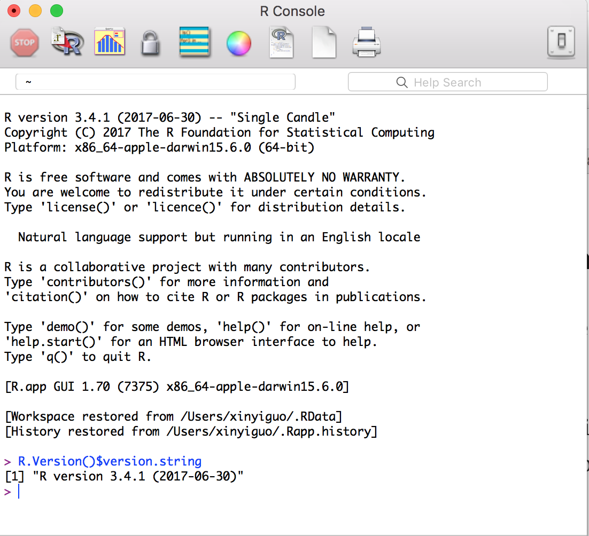
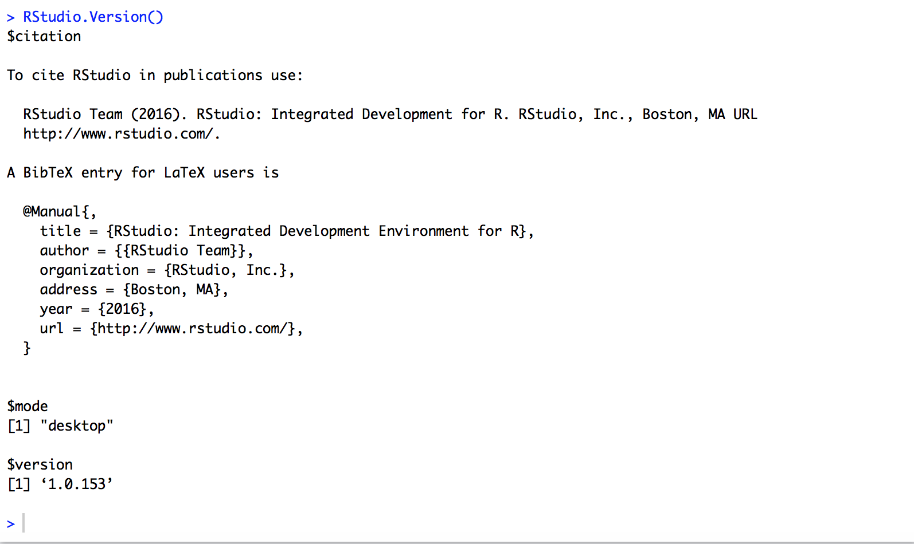
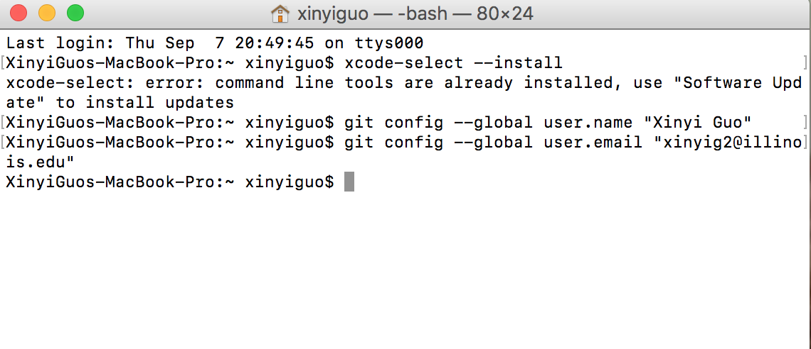
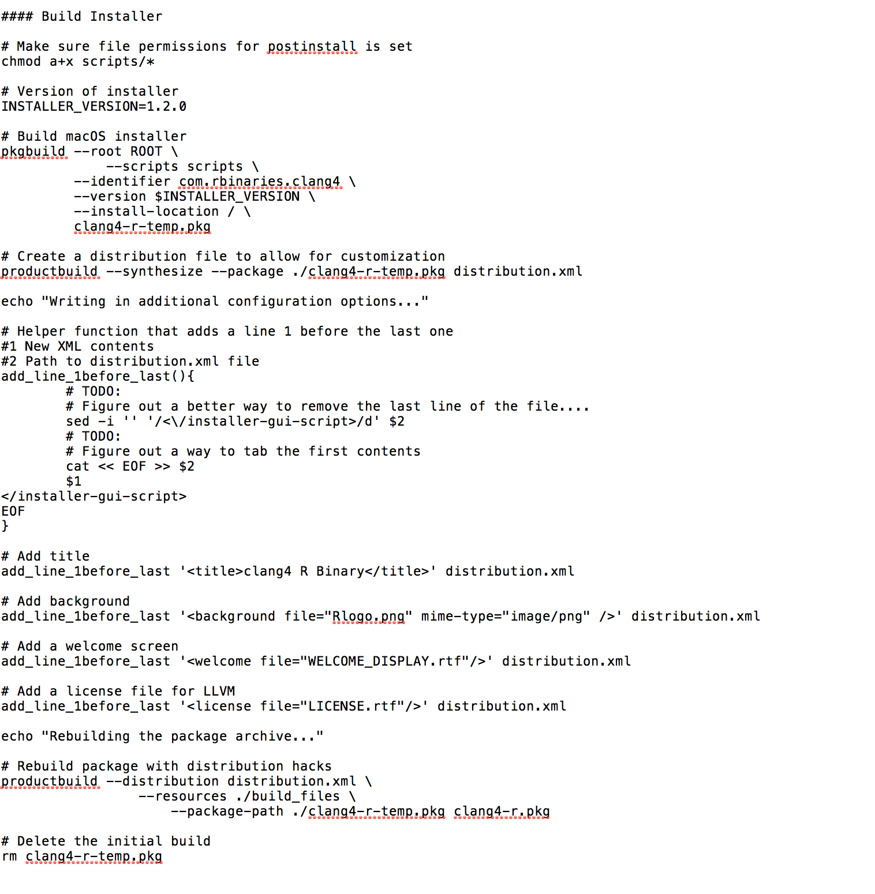
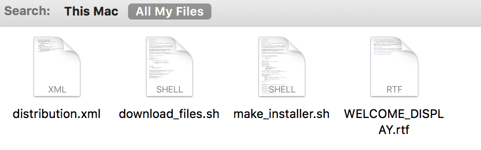
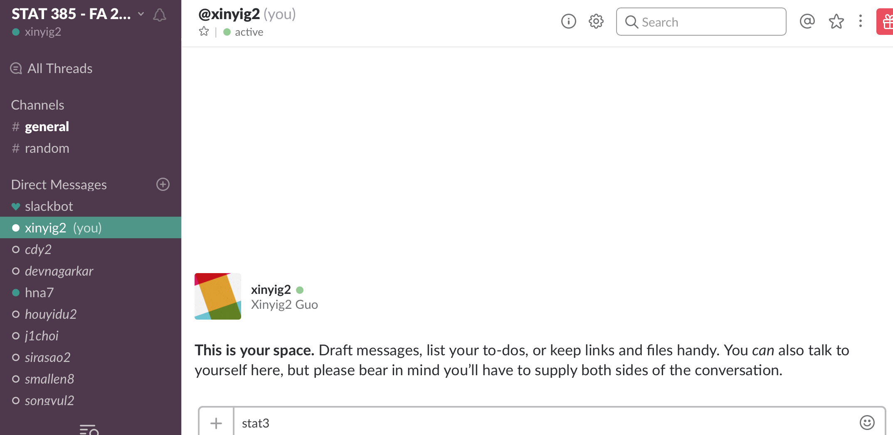
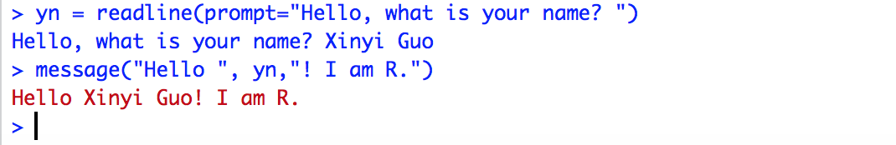
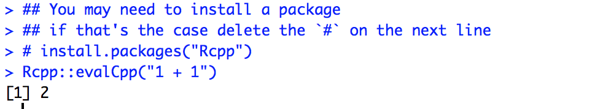
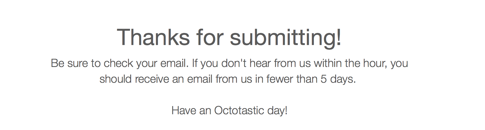

### Exercise 1


























### Exercise 2

Numerical list of answers:

1. James Balamuta is the instructor.
2. His Office is at Tech Plaza 212F. His Office Hours are Tuesday & Thursday, 9:00 - 10:00 AM, at Room G36 of the Foreign Language Building (FLB).
3. No, it is inappropriate. The correct version should be : [STAT 385] Help! Group projct question! .
4. The class meets every Monday, Wednesday, and Friday from 2:00 PM to 2:50 PM at 218 Mechanical Engineering Bldg.
5. There are two exams, one is midterm, which happens appromixately at the middle of the semester, and the other one is the final, which happens at the end of the semester. The exact times for those exams are TBA.
6. Each component of the group project worths 100 points, and not everyone in the group receive a same grade.
7. According to the course's policy, collaborative efforts or using code found online would result in a score of 0 and will deprive the right to have any late submissions.


### Exercise 3





```{r setup, include=FALSE}
knitr::opts_chunk$set(echo = TRUE)
```

## R Markdown

This is an R Markdown document. Markdown is a simple formatting syntax for authoring HTML, PDF, and MS Word documents. For more details on using R Markdown see <http://rmarkdown.rstudio.com>.

When you click the **Knit** button a document will be generated that includes both content as well as the output of any embedded R code chunks within the document. You can embed an R code chunk like this:

```{r cars}
summary(cars)
```

## Including Plots

You can also embed plots, for example:

```{r pressure, echo=FALSE}
plot(pressure)
```

Note that the `echo = FALSE` parameter was added to the code chunk to prevent printing of the R code that generated the plot.
